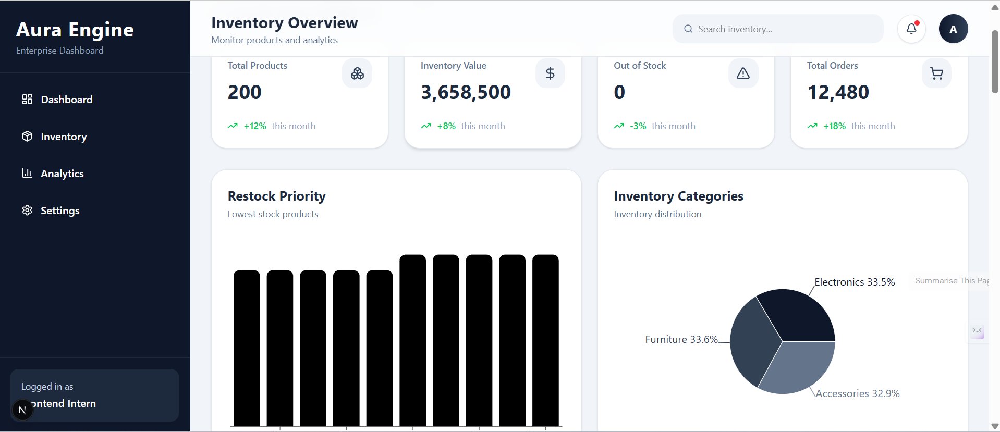

🔗 Live Website: https://aura-enterprise-engine-mauve.vercel.app/

Aura Engine — Enterprise Inventory Dashboard

A modern and responsive enterprise inventory management dashboard built using Next.js, React.js, Tailwind CSS, and Recharts.

This project simulates a real backend-powered admin dashboard architecture using mock inventory data and API routes.

🚀 Features
✅ Responsive Enterprise Layout
Desktop fixed sidebar
Mobile responsive navbar
Hamburger sidebar menu
Smooth mobile sidebar animation
Professional admin dashboard UI

✅ Inventory Management System
Dynamic inventory product table
SKU management
Product category management
Stock tracking
Price management

✅ Advanced Filtering System
Product search
Category dropdown filter
Stock level slider filter
Minimum price filter
Maximum price filter
Price sorting

✅ Server-Side Pagination
Backend-style pagination
Loads only 50 products at a time
Dynamic page navigation
Previous / Next pagination controls
Example API Requests
/api/products?page=1&limit=50
/api/products?page=2&limit=50

✅ Analytics Dashboard
📊 Risk Assessment Chart
Built using Recharts Bar Chart
Displays Top 10 lowest-stock products
Dynamically connected to inventory data

🥧 Portfolio Distribution Chart
Built using Recharts Pie Chart
Shows inventory valuation percentage by category
Example Calculation
category inventory value =
sum(price × stock)

📈 Dynamic KPI Cards
Total SKUs
Total Inventory Value
Out of Stock Products

All KPI cards dynamically update from inventory data.

✅ CSV Export
Export inventory data into CSV format
Downloadable reporting support

✅ Loading Skeletons
Smooth loading animations
Professional user experience

🛠 Tech Stack
Technology	Usage
Next.js 16	Frontend Framework
React.js	UI Development
Tailwind CSS	Styling
Axios	API Requests
Recharts	Analytics Charts

📁 Folder Structure
src/
│
├── app/
│   ├── api/
│   │   └── products/
│   │       └── route.js
│   │
│   ├── globals.css
│   ├── layout.js
│   └── page.js
│
├── components/
│   ├── dashboard/
│   ├── layout/
│   └── table/
│
├── data/
│   └── products.js

⚙️ Backend Simulation Architecture

This project simulates a real enterprise frontend-backend workflow.

products.js
   ↓
route.js API
   ↓
Axios API requests
   ↓
Dashboard + Table + Charts
Explanation
products.js acts as a mock database
route.js acts as backend API
Frontend communicates using Axios requests

✅ Server-Side Pagination Verification

Pagination functionality can be verified using:

Browser DevTools
Network Tab
Fetch/XHR requests

Only 50 records are loaded per request, simulating real backend pagination behavior.

📌 Future Improvements
Authentication System
Dark Mode
Product CRUD Operations
Database Integration
Role-Based Access Control
Backend Deployment

